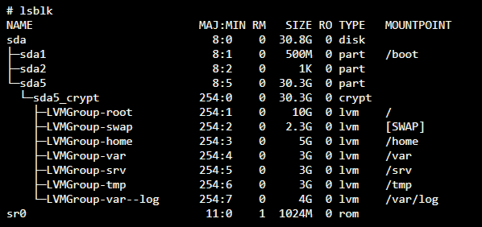
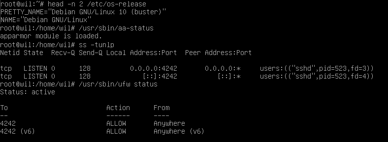

# Born2BeRoot | เกิดเป็นราก

- [Disk Structure Setup](#disk-structure-setup)
- [Hostname](#hostname)
- [Sudo](#sudo)
  - [**`/etc/sudoers.d/config`**](#etcsudoersdconfig)
- [SSH](#ssh)
  - [**`/etc/ssh/sshd_config`**](#etcsshsshd_config)
- [UFW (Uncomplicated Firewall)](#ufw-uncomplicated-firewall)
- [Password Policy](#password-policy)
  - [**`/etc/login.defs`**](#etclogindefs)
  - [**`/etc/pam.d/common-password`**](#etcpamdcommon-password)
- [Create user / Assign yourself to group `user42` and `sudo`](#create-user--assign-yourself-to-group-user42-and-sudo)
- [`monitoring.sh`](#monitoringsh)

## Disk Structure Setup

<details>
  <summary>Subject</summary>
  
  
</details>

https://www.youtube.com/watch?v=2w-2MX5QrQw

## Hostname

<details>
    <summary>Subject</summary>

     The hostname of your virtual machine must be your login ending with 42 (e.g., wil42). You will have to modify this hostname during your evaluation.

</details>

```bash
hostnamectl set-hostname <hostname> # or edit /etc/hostname
vi /etc/hosts
```

## Sudo

<details>
    <summary>Subject</summary>

```
You have to install and configure sudo following strict rules.

To set up a strong configuration for your sudo group, you have to comply with the

following requirements:
• Authentication using sudo has to be limited to 3 attempts in the event of an incorrect password.
• A custom message of your choice has to be displayed if an error due to a wrong
password occurs when using sudo.
• Each action using sudo has to be archived, both inputs and outputs. The log file
has to be saved in the /var/log/sudo/ folder.
• The TTY mode has to be enabled for security reasons.
• For security reasons too, the paths that can be used by sudo must be restricted.
Example:
/usr/local/sbin:/usr/local/bin:/usr/sbin:/usr/bin:/sbin:/bin:/snap/bin
```

</details>

```bash
su - # access to root
apt install sudo # install sudo
dpkg -l | grep sudo # verify that sudo has installed
adduser <user> sudo # add user to sudo or usermod -aG sudo <user>
getent group sudo # get list of user in group sudo
sudo mkdir /var/log/sudo # create log for sudo first
reboot
```

#### **`/etc/sudoers.d/config`**

```
Defaults requiretty
Defaults passwd_tries=3
Defaults badpass_message="Denide"
Defaults logfile="/var/log/sudo/log"
Defaults log_input,log_output
Defaults iolog_dir="/var/log/sudo"
Defaults secure_path="/usr/local/sbin:/usr/local/bin:/usr/sbin:/usr/bin:/sbin:/bin:/snap/bin"
```

# SSH

<details>
    <summary>Subject</summary>

```
A SSH service will be running on port 4242 only. For security reasons, it must not be
possible to connect using SSH as root.

The use of SSH will be tested during the defense by setting up a new
account. You must therefore understand how it works.
```

</details>

```bash
sudo apt install openssh-server # install SSH via apt
dpkg -l | grep ssh # verify that SSH is installed
```

#### **`/etc/ssh/sshd_config`**

```
Port 4242
PermitRootLogin no
```

Restart SSH service to apply configuration

```bash
sudo service ssh status
sudo service ssh restart
```

## UFW (Uncomplicated Firewall)

<details>
    <summary>Subject</summary>

```
You have to configure your operating system with the UFW (or firewalld for Rocky)
firewall and thus leave only port 4242 open.
```

</details>

```bash
sudo apt install ufw # install ufw via apt
sudo ufw enable # enable ufw
sudo ufw allow 4242 # allow port 4242 (SSH) by default ufw will not allow any port
sudo ufw status # check status of firewall
```

# Password Policy

<details>
    <summary>Subject</summary>

```
You have to implement a strong password policy.

To set up a strong password policy, you have to comply with the following requirements:
• Your password has to expire every 30 days.
• The minimum number of days allowed before the modification of a password will
be set to 2.
• The user has to receive a warning message 7 days before their password expires.
• Your password must be at least 10 characters long. It must contain an uppercase
letter, a lowercase letter, and a number. Also, it must not contain more than 3
consecutive identical characters.
• The password must not include the name of the user.
• The following rule does not apply to the root password: The password must have
at least 7 characters that are not part of the former password.
• Of course, your root password has to comply with this policy.
```

</details>

#### **`/etc/login.defs`**

```
PASS_MAX_DAYS   30
PASS_MIN_DAYS   2
PASS_WARN_AGE   7
```

```bash
sudo apt install libpam-pwquality
dpkg -l | grep libpam-pwquality
```

#### **`/etc/pam.d/common-password`**

```
password requisite pam_pwquality.so retry=3 minlen=10 lcredit=-1 ucredit=-1 dcredit=-1 maxrepeat=3 reject_username difok=7 enforce_for_root
```

## Create user / Assign yourself to group `user42` and `sudo`

<details>
    <summary>Subject</summary>

```
• In addition to the root user, a user with your login as username has to be present.
• This user has to belong to the user42 and sudo groups.
```

</details>

```bash
sudo adduser <username> # Create user
getent passwd <username> # Check if user was successfully created
sudo chage -l <username> # Check password expiry info

sudo addgroup user42 # Create group 42 if not exists
sudo adduser <username> user42 # add user group user42
getent group user42 # Check user in group user42

adduser <username> sudo # if you want to add user to sudo groups
```

## `monitoring.sh` and CRON job

<details>
    <summary>Subject</summary>

```
Finally, you have to create a simple script called monitoring.sh. It must be developed in bash.

At server startup, the script will display some information (listed below) on all terminals every 10 minutes (take a look at wall).
The banner is optional.
No error must be visible.

Your script must always be able to display the following information:
  • The architecture of your operating system and its kernel version.
  • The number of physical processors.
  • The number of virtual processors.
  • The current available RAM on your server and its utilization rate as a percentage.
  • The current available memory on your server and its utilization rate as a percentage.
  • The current utilization rate of your processors as a percentage.
  • The date and time of the last reboot.
  • Whether LVM is active or not.
  • The number of active connections.
  • The number of users using the server.
  • The IPv4 address of your server and its MAC (Media Access Control) address.
  • The number of commands executed with the sudo program.
```

Expect Result

```
Broadcast message from root@wil (tty1) (Sun Apr 25 15:45:00 2021):
#Architecture: Linux wil 4.19.0-16-amd64 #1 SMP Debian 4.19.181-1 (2021-03-19) x86_64 GNU/Linux
#CPU physical : 1
#vCPU : 1
#Memory Usage: 74/987MB (7.50%)
#Disk Usage: 1009/2Gb (49%)
#CPU load: 6.7%
#Last boot: 2021-04-25 14:45
#LVM use: yes
#Connections TCP : 1 ESTABLISHED
#User log: 1
#Network: IP 10.0.2.15 (08:00:27:51:9b:a5)
#Sudo : 42 cmd
```

References



</details>

See` monitoring.sh`

```bash
sudo crontab -u root -e # edit CRON as root
*/10 * * * * sh /path/to/script # add this to editor prompt and save
sudo crontab -u root -l # check CRON has successfully test
```

## Tester

https://github.com/gemartin99/Born2beroot-Tester.git

## [BONUS] Wordpress website (lighttpd MariaDB PHP)

Set up a functional WordPress website with the following services: lighttpd, MariaDB, and PHP.

```bash
sudo apt install lighttpd mariadb-server php-cgi php-mysql wget
# install require services
sudo ufw allow 80 # open port HTTP 80
sudo mysql_secure_installation # setup mariadb services

# after setup
sudo mariadb

# MariaDB SQL Shell
CREATE DATABASE <database-name>;
GRANT ALL ON <database-name>.* TO '<username-2>'@'localhost' IDENTIFIED BY '<password-2>' WITH GRANT OPTION;
FLUSH PRIVILEGES;
exit;

mariadb -u <username-2> -p

# MariaDB SQL Shell
SHOW DATABASES;

+--------------------+
| Database           |
+--------------------+
| information_schema |
| <database-name>    |
+--------------------+

exit;

# WORDPRESS SETUP
cd /var/www/html
sudo wget http://wordpress.org/latest.tar.gz
sudo tar -xzvf /var/www/html/latest.tar.gz
sudo rm /var/www/html/latest.tar.gz
sudo cp -r /var/www/html/wordpress/* /var/www/html
sudo rm -rf /var/www/html/wordpress
sudo cp /var/www/html/wp-config-sample.php /var/www/html/wp-config.php
sudo vi /var/www/html/wp-config.php
# EDIT THIS TO CONNECT TO YOUR DATABASE
# define( 'DB_NAME', 'database_name_here' );
# define( 'DB_USER', 'username_here' );
# define( 'DB_PASSWORD', 'password_here' );

sudo lighty-enable-mod fastcgi
sudo lighty-enable-mod fastcgi-php
sudo service lighttpd force-reload

# Now you can forward port to 80 in virtualbox settings
# and access localhost:80 to setup Wordpress :D
```

## [BONUS] Additional Services (Docker and Composer)

Why Docker?

When you deploy application you want to have great deploy experience (Compare to try to deploy Wordpress with method above)

Docker will be my choice

```bash
# Official installion documentation
# https://docs.docker.com/engine/install/debian/

# Add Docker's official GPG key:
sudo apt-get update
sudo apt-get install ca-certificates curl gnupg
sudo install -m 0755 -d /etc/apt/keyrings
curl -fsSL https://download.docker.com/linux/debian/gpg | sudo gpg --dearmor -o /etc/apt/keyrings/docker.gpg
sudo chmod a+r /etc/apt/keyrings/docker.gpg

# Add the repository to Apt sources:
echo \
  "deb [arch=$(dpkg --print-architecture) signed-by=/etc/apt/keyrings/docker.gpg] https://download.docker.com/linux/debian \
  $(. /etc/os-release && echo "$VERSION_CODENAME") stable" | \
  sudo tee /etc/apt/sources.list.d/docker.list > /dev/null
sudo apt-get update

sudo apt-get install docker-ce docker-ce-cli containerd.io docker-buildx-plugin docker-compose-plugin

sudo docker run hello-world # Run simple Hello World with Docker
```

#### **`compose.yaml`**

```docker
# https://github.com/docker/awesome-compose/tree/master/wordpress-mysql
services:
  db:
    # We use a mariadb image which supports both amd64 & arm64 architecture
    image: mariadb:10.6.4-focal
    # If you really want to use MySQL, uncomment the following line
    #image: mysql:8.0.27
    command: '--default-authentication-plugin=mysql_native_password'
    volumes:
      - db_data:/var/lib/mysql
    restart: always
    environment:
      - MYSQL_ROOT_PASSWORD=somewordpress
      - MYSQL_DATABASE=wordpress
      - MYSQL_USER=wordpress
      - MYSQL_PASSWORD=wordpress
    expose:
      - 3306
      - 33060
  wordpress:
    image: wordpress:latest
    volumes:
      - wp_data:/var/www/html
    ports:
      - 8081:80
    restart: always
    environment:
      - WORDPRESS_DB_HOST=db
      - WORDPRESS_DB_USER=wordpress
      - WORDPRESS_DB_PASSWORD=wordpress
      - WORDPRESS_DB_NAME=wordpress
volumes:
  db_data:
  wp_data:
```

```bash
# You have to be in same directory as compose.yml
sudo docker compose up -d # to start up services
# -d is for running in background
sudo docker compose down # to stop running services
sudo docker image prune -a # to delete every image that doesn't use anymore
```
